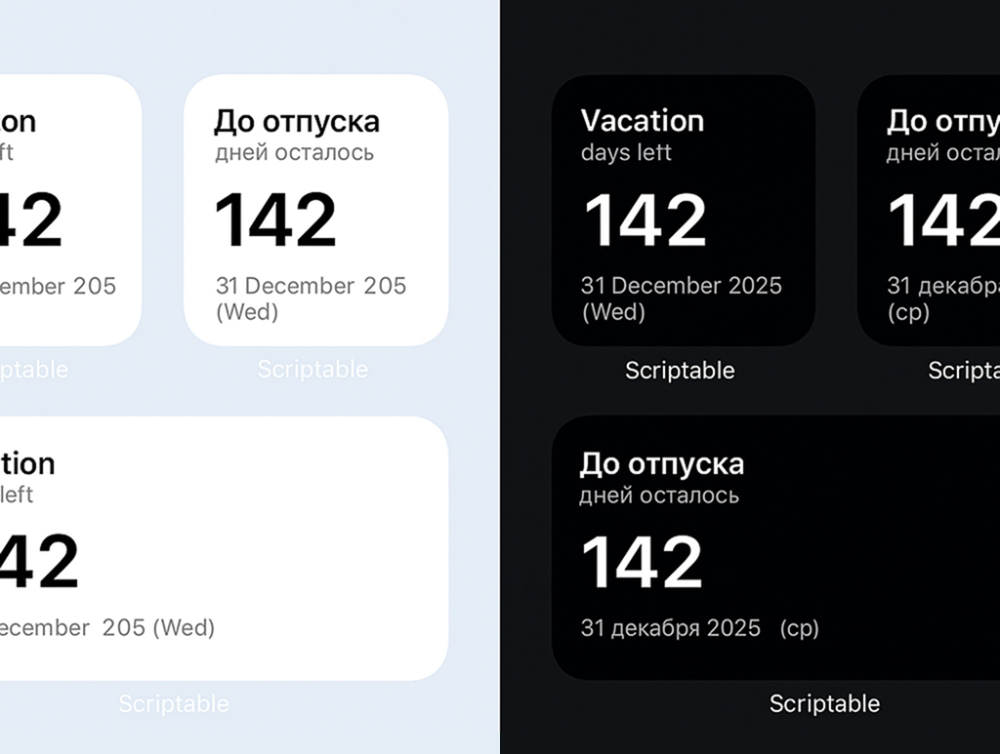

# Scriptable Countdown Widget

[🇷🇺 Читать на русском](./readme/README-ru.md)

A minimalist, text-only countdown widget for the [Scriptable](https://scriptable.app) iOS app.  
Supports **English** (default) and **Russian**, auto font sizing for the days counter, and automatic truncation with ellipsis for long titles or dates.

## Features

- 🗓 Countdown to any target date.
- 🌐 Language: English (default) or Russian (`|ru`).
- 🔠 Auto font size adjustment for the number of days.
- ✂️ Automatic ellipsis for long text.
- 📱 Works on Small, Medium, and Large widget sizes.
- ⚡ Simple to set up — just paste the script into Scriptable.

## Installation

1. Install the [Scriptable](https://scriptable.app) app from the App Store.
2. Create a new script and paste the code from `countdown-widget.js`.
3. Add a Scriptable widget to your home screen.
4. In the widget configuration:
   - **Script**: Select this script.
   - **Parameter**: Use the format `Title|YYYY-MM-DD|lang`:
     - `Title` — your event name.
     - `YYYY-MM-DD` — target date.
     - `lang` _(optional)_ — `en` (default) or `ru`.

**Examples:**

- `Vacation|2025-12-31` → English, date December 31, 2025
- `Отпуск|2025-12-31|ru` → Russian, date 31 декабря 2025

## License

MIT License — feel free to use and modify.
